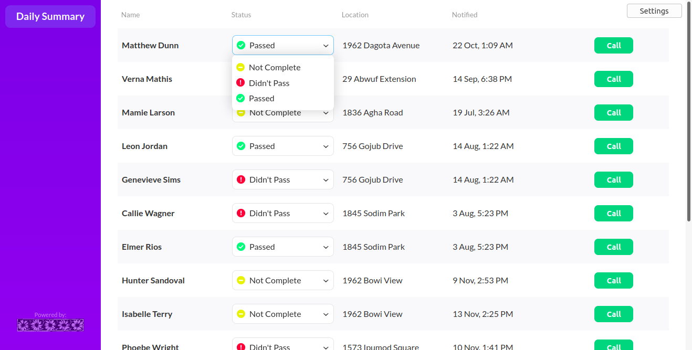

# Twilio Client

This project was created as an assessment task for a job interview at a California startup company (not related to [Twilio](https://twilio.com/) itself). It uses React for the frontend and PHP for the backend. It does the following:

1. Shows a list of some providers with contact info and Call button.
1. When the button is clicked, the backend calls some administrator using Twilio API and speaks a message.
1. From the same call the selected provider is called and connected to the administrator when the call is answered.



The frontend UI features include custom dropdown lists, table sorting, and an adaptive layout. It also queries the backend for call status and shows notifications.

Any phone numbers can be used for both calls. Call status is tracked with hooks. A MySQL database is used to store the list of providers and call history.

## How to run

### Backend

1. Create a MySQL database and run `generate.sql` on it.
1. Edit `hidden/config.json` and fill all the missing data.
1. Place the `back` folder to a web server so that `public` directory is used as the doc root, or rename `public` to anything you like.

You may use `localhost` for almost all the testing, except that Twilio hooks require a public host name. 

To test your setup, request the URL:
`https://your-public-host.com/api/getProviders`

### Frontend

1. Edit `front/src/Client.js` and set your backend URL in `baseUrl` property.
1. Run:

```bash
npm install
npm start
```

This should open `https://localhost:3000` in your default browser. Navigate there manually if this did not happen.

## Credit

- The layout was provided as a raster image by the company requesting the task be done. Frontend and the screenshot are a custom work of mine.
- The public domain logo placeholder was obtained at https://publicdomainvectors.org/en/free-clipart/Daisy-vector-border/1462.html
